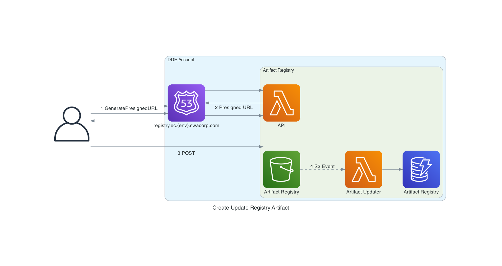

# Getting Started

## Creating a new Registry Artifact

The Registry Artifact is essentially a DDE Artifact, but with some additional metadata.  We use the same Deployment Package that is used for DDE, however, during the Presigned URL request, we required some additional data.

1. Create a [DDE Artifact](https://docs.dde.ec.prod.aws.swacorp.com/user_guide/working_with_deployments.html)
2. Generate a [Presigned URL](api.md#generatepresignedurl) for the DDE Artifact
3. Upload (POST) the DDE Artifact

## Presigned URL Steps

| Step | Description |
| --- | --- |
| 1. | Call GeneratePresignedURL to retrieve a Presigned Post URL.  The Presigned Post URL request includes metadata that will be stored in the DynamoDB Table when the Artifact is POST'ed. |
| 2. | API Lambda returns the Presigned https URL |
| 3. | Upload DDE Artifact using the Presigned URL |
| 4. | Once the Artifact is Put into the Artifact Registry S3 Bucket, an Event is triggered.  The event is processed by the Artifact Updater lambda, which updates the Artifact Registry DynamoDB table. |

## Presigned URL Metadata

The following

| Parameter | Description | Example |
| --- | --- | --- |
| Stack Name | CloudFormation Stack Name | Stack-Name |
| Artifact Key | S3 Key for the Artifact | /some/artifact/key.zip |
| Owner Account Id | AWS Account Id for the Developer Account. | 1234567890 |
| Deployment Selector | Identifies the Artifact that will be deployed to the new account, based on the Account Type | |
| AWS Region | [AWS Region](https://aws.amazon.com/about-aws/global-infrastructure/regions_az/) | us-east-1 |
| Dependent Artifacts | List of ARN's for Artifacts that this artifact depends on.  | `arn:aws:ec-artifact-registry:us-east-1:1234567890:artifact/StackName/DeploymentSelector` |
